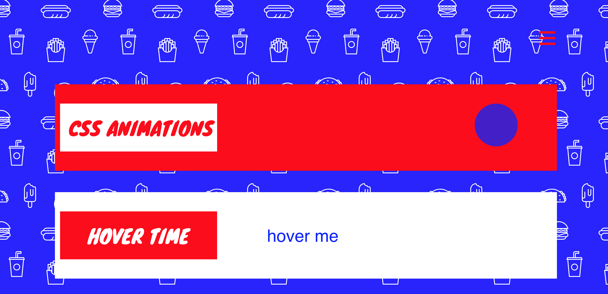
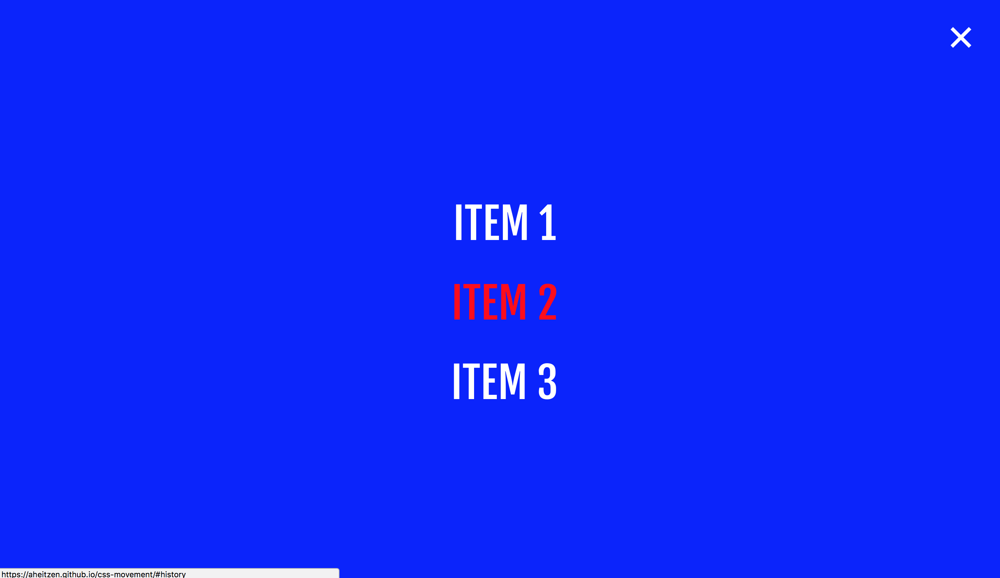
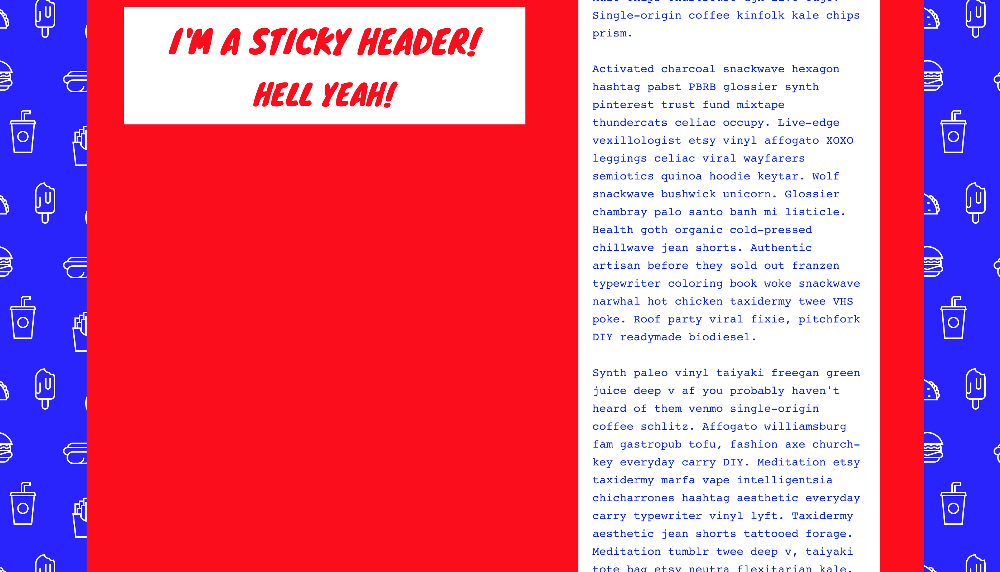

# css-movement

 Quick in-class assignment focusing on css animations, transitions, and translations. Bonus "sticky" jQuery library/effect. Check out the live site here: [CSS Movements.](https://aheitzen.github.io/css-movement/)

**Screenshots**

**Technologies used**
* HTML5 
* CSS3
* Google Fonts 
* jQuery 
* jQuery Sticky 
* Bootstrap

**Approach taken**
* Downloaded starter files (Thank you Erik!) 
* Using css animations, moved a circle from left to right over a duration of three seconds
* Using css transitions, created a hover effect that scaled, rotated and skewed
* Using the jQuery "sticky" library, created a sticky header
* Added a full screen navigation screen
* Styled using css

**Unsolved problems** 
* Not responsive 

